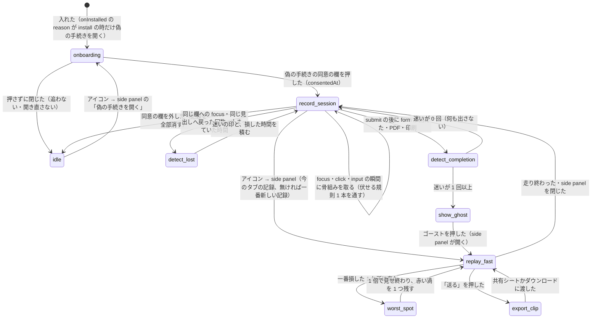
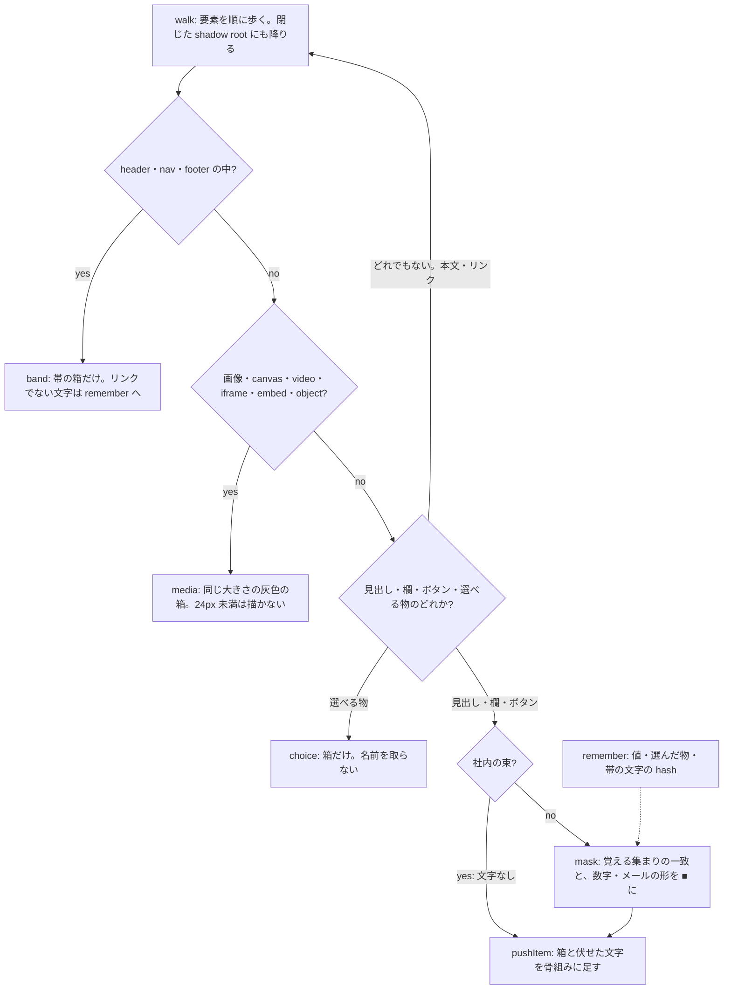

# 開発図

図の識別子（英字の名前）は、実装に同じ名前で現れる。突き合わせは `bash docs/diagrams-check.sh`（下の「再測手順」）。

## 1. MVP の流れ（1 つのタブの中）

出典: EP-0001 REQ-1〜7・PBI-0002 G1（2026-09-27 更新）

- 入口は拡張のアイコン 1 つ（popup は持たない）。押すと side panel が開く
- 記録は `chrome.storage.session`（メモリだけ）。外へ送る経路は持たない

## 2. 記録の単位（束 = タブ＋そこから開いたタブ）

出典: `src/session.js` の reducer・EP-0001 REQ-6（2026-09-27）

```mermaid
stateDiagram-v2
    [*] --> prelude: page（同意済みの最初の骨組み）
    prelude --> prelude: page が別のサイト → 前のサイトの分を捨てて取り直す
    prelude --> homed: ev が検索欄でない欄への input → 本拠 = そのページのサイト
    homed --> homed: page が本拠 → 記録する ／ hello がよそのサイト → away の箱だけ・take:false
    prelude --> closed: done（W1 は偽の手続きの完了だけ）
    homed --> closed: done
    closed --> prelude: page が来た → 閉じた記録を捨てて次の手続き
    prelude --> [*]: tick 30 分 ／ tab_removed で束が空 ／ revoke
    homed --> [*]: tick 30 分 ／ tab_removed で束が空 ／ revoke
    closed --> [*]: tick 30 分 ／ tab_removed で束が空 ／ revoke
```

- tab_created の openerTabId が束のタブなら、同じ束に入る
- 束がドットの無いホスト・私的 IP・.local・会社専用の login 窓口（okta・onelogin）を通ったら internal: 文字を全部落とし、以後も取らない

## 3. 伏せる規則（1 本。記録する時に当てる）

出典: `src/recorder.js` の歩き方・`src/redact.js`（2026-09-27）

- 骨組みを取る前に、今のページの値を全部 remember に入れる（取った後に消す 2 本目は持たない）
- 取るのは focus・click・input の瞬間だけ。最初の focus か click までは何も送らない

## 再測手順

`bash docs/diagrams-check.sh` が次を確かめる（ずれたら exit 1。`git commit` の前に hook が走らせる）:

1. 図の識別子（stateDiagram の状態・flowchart の節点）の集合 = 下の「実装済み」∪「未実装」
2. 「実装済み」は全部 `src/` に単語として在る。「未実装」は `src/` に 1 つも無い（実装したら「実装済み」へ移す）
3. 図 2 の状態の集合 = `src/session.js` で `phase` に入れる値の集合（`phase:` と `phase =`）

実装済み: onboarding idle record_session replay_fast prelude homed closed walk inBand band isMedia media kindOf choice noText pushItem mask remember
未実装: detect_lost detect_completion show_ghost worst_spot export_clip
