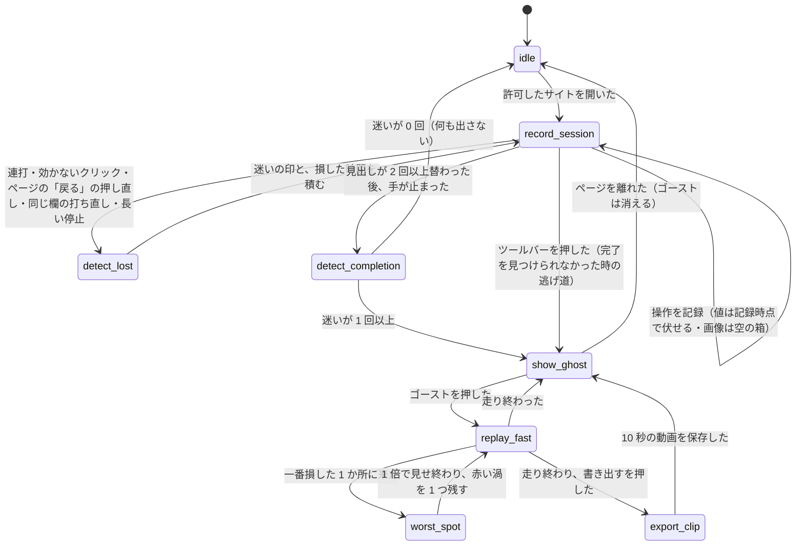

# 開発図

図の識別子（英小文字の名前）は、実装に同じ名前で現れる。実装が入ったら、突き合わせる検査を置く。

## 1. MVP の流れ（1 つのタブの中）

```mermaid
stateDiagram-v2
    [*] --> idle
    idle --> record_session: 許可したサイトを開いた
    record_session --> record_session: 操作を記録（値は記録時点で伏せる・画像は空の箱）
    record_session --> detect_lost: 連打・効かないクリック・ページの「戻る」の押し直し・同じ欄の打ち直し・長い停止
    detect_lost --> record_session: 迷いの印と、損した時間を積む
    record_session --> detect_completion: 見出しが 2 回以上替わった後、手が止まった
    detect_completion --> idle: 迷いが 0 回（何も出さない）
    detect_completion --> show_ghost: 迷いが 1 回以上
    record_session --> show_ghost: ツールバーを押した（完了を見つけられなかった時の逃げ道）
    show_ghost --> idle: ページを離れた（ゴーストは消える）
    show_ghost --> replay_fast: ゴーストを押した
    replay_fast --> worst_spot: 一番損した 1 か所に来た
    worst_spot --> replay_fast: 1 倍で見せ終わり、赤い渦を 1 つ残す
    replay_fast --> export_clip: 走り終わり、書き出すを押した
    replay_fast --> show_ghost: 走り終わった
    export_clip --> show_ghost: 10 秒の動画を保存した
```

- 記録は端末の中（拡張の storage）だけに置く。外へ送る経路は持たない
- 渦は 1 回の再生に 1 つだけ（一番損した所）
