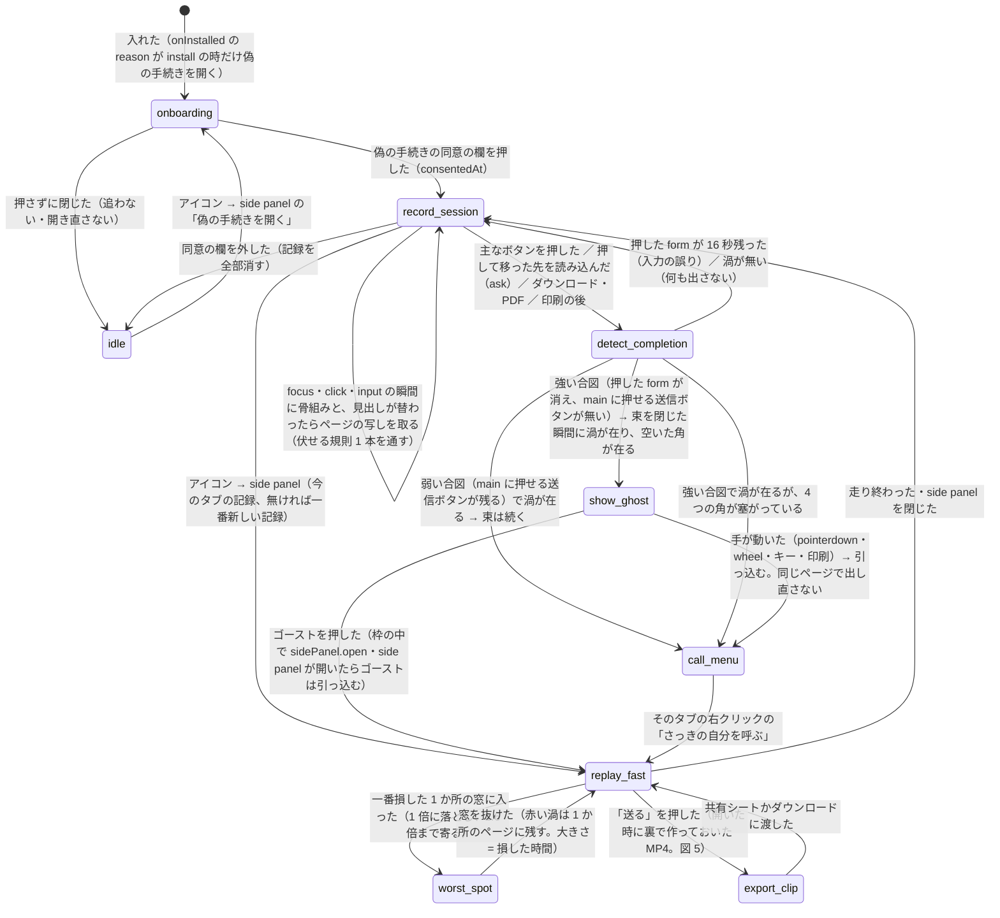
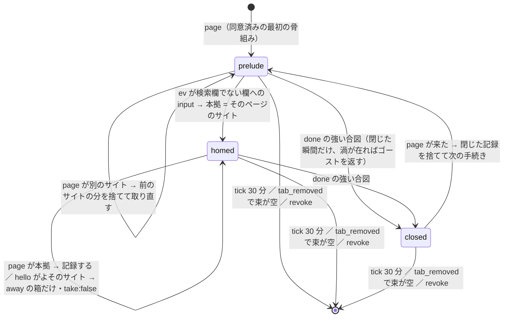
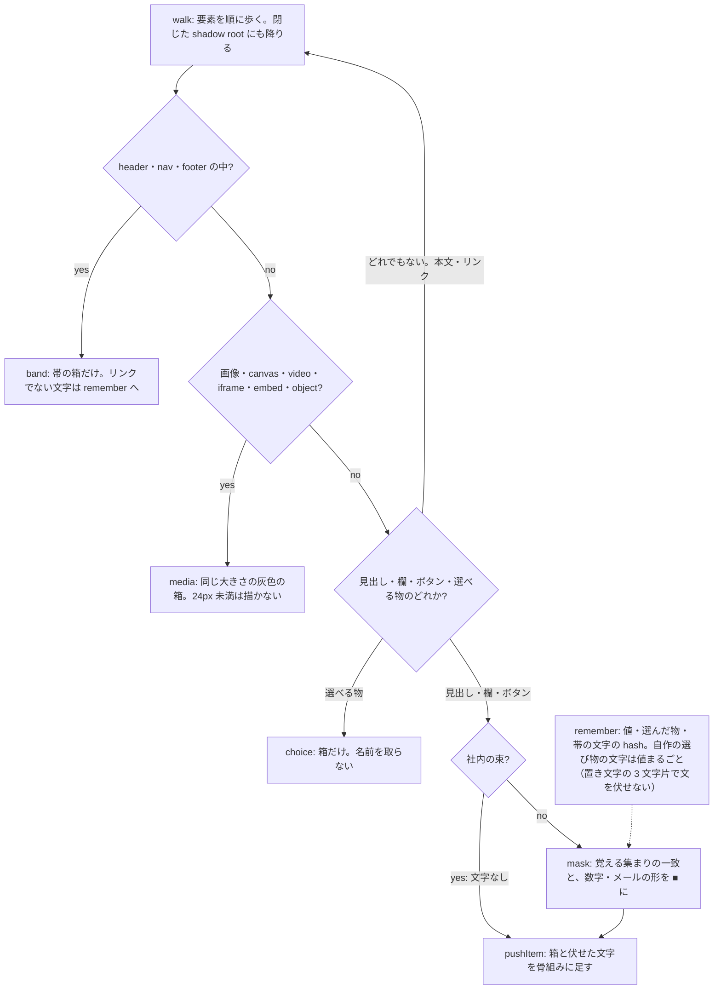
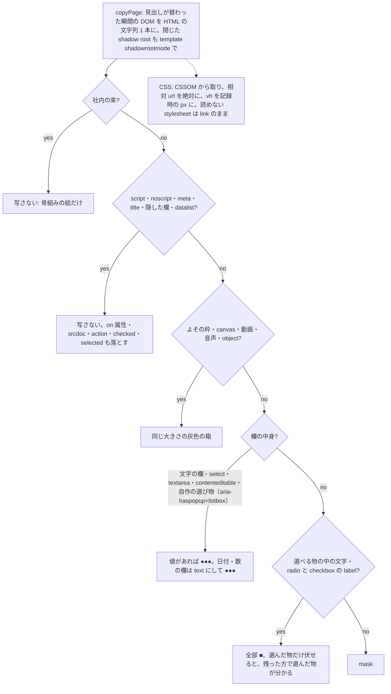
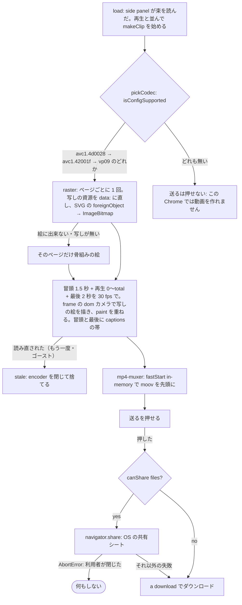

# 開発図

図の識別子（英字の名前）は、実装に同じ名前で現れる。構造が変わる変更は同じ commit で図も直す（機械の突き合わせはしない）。

## 1. MVP の流れ（1 つのタブの中）

出典: EP-0001 REQ-1〜7・PBI-0002 G1・PBI-0003 G1・PBI-0004 G1・PBI-0007（2026-09-27 更新）

- 入口は拡張のアイコン 1 つ（popup は持たない）。押すと side panel が開く
- 記録を読む口（`get`）は拡張のページにだけ答える（`sender.url` が `chrome-extension://<自分>/`）。content script（乗っ取られた renderer）からは読めない
- 記録は `chrome.storage.session`（メモリだけ）。外へ送る経路は持たない
- 迷いは記録中の状態ではなく、記録から後で計算する（図 4）。再生・完了（W3）・動画（W4）が同じ関数を呼ぶ
- 合図の強さは 1 本の `judge`（main に押せる送信ボタンが残るか）。偽の手続きも同じ道で完了する（専用の道を持たない）
- 再生（replay_fast・worst_spot）は、写しの在るページを side panel の sandbox の iframe（script なし・押せない）に srcdoc で建て直し、`frame` のカメラで動かす。canvas はその上に ●●●・渦・ゴーストだけを重ねる。写しの無いページ（社内の束・大きすぎた・上限で捨てた）は骨組みの絵
- ゴーストは拡張のページ（ghost.html）の枠。サイトの文書に記録は入らない。角は右下 → 左下 → 右上 → 左上の順に、固定の要素・文字・欄・ボタン・リンク・画像と重ならない所を 1 回だけ選ぶ

## 2. 記録の単位（束 = タブ＋そこから開いたタブ）

出典: `src/session.js` の reducer・EP-0001 REQ-6（2026-09-27）

- tab_created の openerTabId が束のタブなら、同じ束に入る
- done の弱い合図は段を変えない（`weak` の印だけ。束は続き、右クリックで呼べる）。ask（完了を判定してよいか）は段を変えない
- 束がドットの無いホスト・私的 IP・.local・会社専用の login 窓口（okta・onelogin）を通ったら internal: 文字と写しを全部落とし、以後も取らない
- storage.session の上限に当たったら、一番大きい束の一番古い写しから捨てる（そのページは骨組みの絵に落ちる）。写しが尽きたら一番古いページから

## 3. 伏せる規則（1 本。骨組みにも写しにも、記録する時に当てる）

出典: `src/recorder.js` の歩き方・写し（copyPage）・`src/redact.js`・PBI-0007（2026-09-27）

- 骨組みと写しを取る前と、押した（click）瞬間に、今のページの値を全部 remember に入れる（取った後に消す 2 本目は持たない。自作の選び物は input を出さないので、押した瞬間が次の画面より前に覚える所）
- 自作の選び物（`aria-haspopup=listbox`。Headless UI の Listbox など）は欄: 名前は label から取り（自分を指す aria-labelledby と中の文字は飛ばす）、中の文字は値
- 覚える集まりが後から育ったら（1 ページ目の本文に出ていた名前を 2 ページ目で初めて打った）、reducer の addMemo が前に取った骨組み・事象・写しの文字にも**同じ mask** を新しい分だけ当て直す（規則は 1 本のまま。見える属性の一覧 TEXT_ATTR も redact.js の 1 本を recorder と session が読む）
- 本文・見出し・ボタン・見える属性（alt・title・placeholder・datetime・download・aria-・data-）の文字は mask を通して実際のまま。資源の URL（画像・CSS）は再生で読み直すので残し、ページ自身の URL（パスとクエリ）は残さない（空の URL は写さない）
- 取るのは focus・click・input の瞬間だけ。最初の focus か click までは何も送らない

## 4. 迷いの検出（記録から後で計算する 1 本）

出典: `src/lost.js`・PBI-0003 G1（2026-09-27）

- 印（`([ ])` の形の節点）の集合 = `src/lost.js` が `mark('<kind>', …)` で立てる印の集合
- 再生は worstSpot の t0〜t1 の窓に入る事象へ向かう間を 1 倍（1 つの間は 1.5 秒・窓全体で 6 秒まで）にし、渦を 1 つだけ描く

## 5. 動画の書き出し（side panel を開いた時に裏で作り、「送る」で渡す）

出典: `src/clip.js`・`src/sidepanel.js`・PBI-0005 G1（2026-09-27）

- 動画の材料は記録（写し・事象）と、写しに在る資源の GET だけ。記録や動画を載せた送信は持たない
- 焼き込み（`captions`）は ① 登録できるドメイン（`siteOf`）② 閉じた束の最後のページの見出し ③ 一番の迷いの窓の後の最初の名前の在る click。社内の束は 0 行
