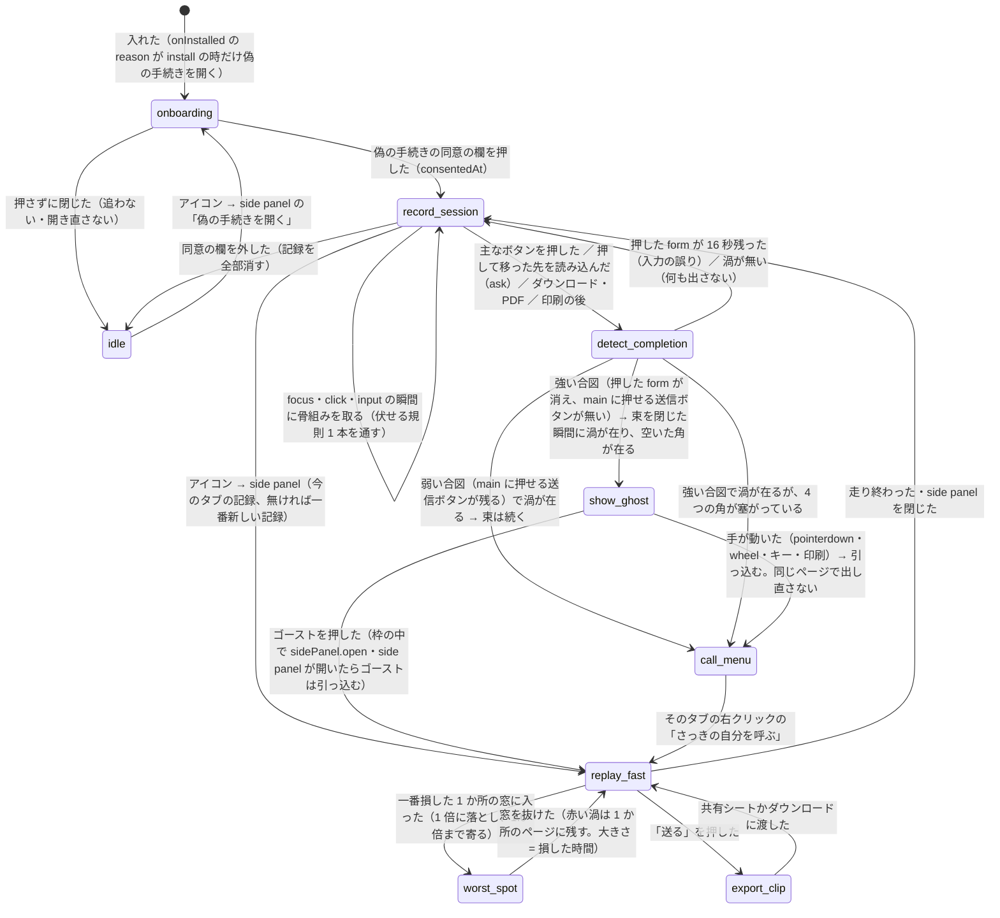
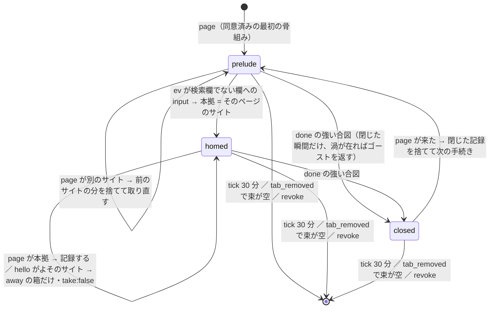
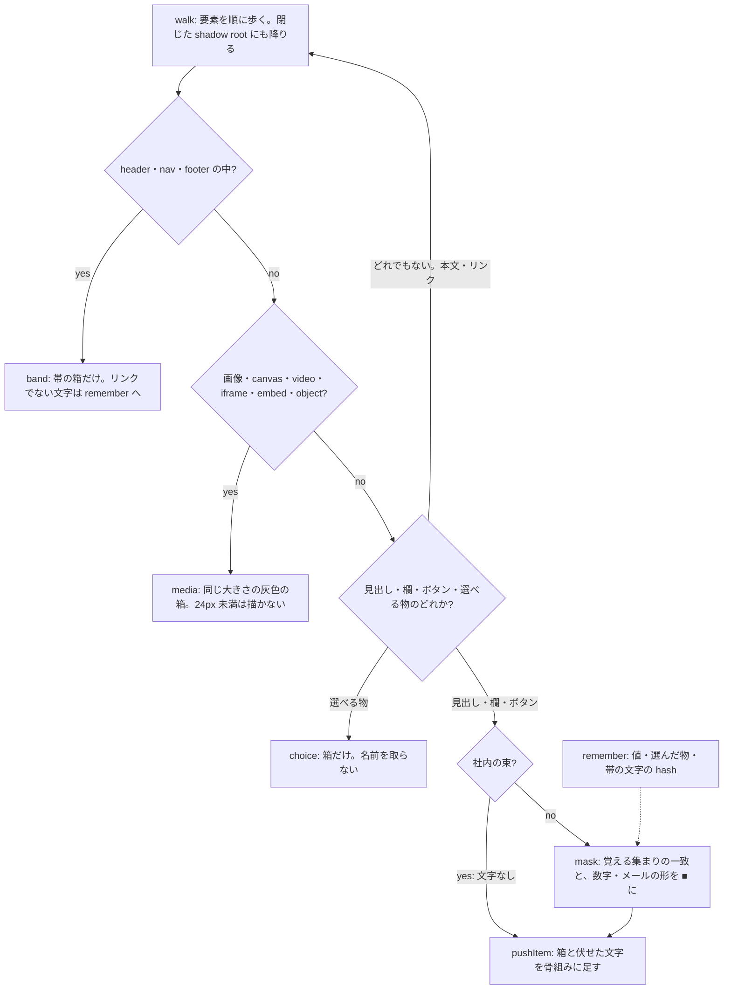
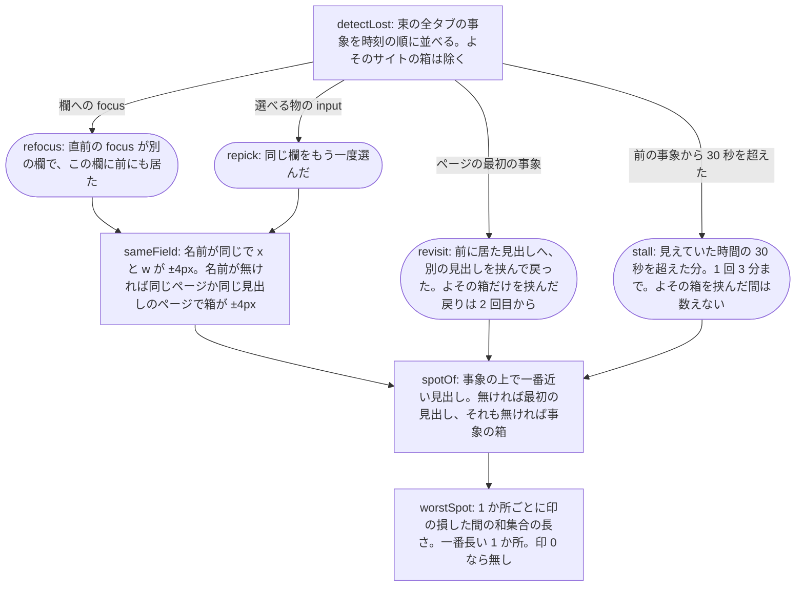

# 開発図

図の識別子（英字の名前）は、実装に同じ名前で現れる。突き合わせは `bash docs/diagrams-check.sh`（下の「再測手順」）。

## 1. MVP の流れ（1 つのタブの中）

出典: EP-0001 REQ-1〜7・PBI-0002 G1・PBI-0003 G1・PBI-0004 G1（2026-09-27 更新）

- 入口は拡張のアイコン 1 つ（popup は持たない）。押すと side panel が開く
- 記録は `chrome.storage.session`（メモリだけ）。外へ送る経路は持たない
- 迷いは記録中の状態ではなく、記録から後で計算する（図 4）。再生・完了（W3）・動画（W4）が同じ関数を呼ぶ
- 合図の強さは 1 本の `judge`（main に押せる送信ボタンが残るか）。偽の手続きも同じ道で完了する（専用の道を持たない）
- ゴーストは拡張のページ（ghost.html）の枠。サイトの文書に記録は入らない。角は右下 → 左下 → 右上 → 左上の順に、固定の要素・文字・欄・ボタン・リンク・画像と重ならない所を 1 回だけ選ぶ

## 2. 記録の単位（束 = タブ＋そこから開いたタブ）

出典: `src/session.js` の reducer・EP-0001 REQ-6（2026-09-27）

- tab_created の openerTabId が束のタブなら、同じ束に入る
- done の弱い合図は段を変えない（`weak` の印だけ。束は続き、右クリックで呼べる）。ask（完了を判定してよいか）は段を変えない
- 束がドットの無いホスト・私的 IP・.local・会社専用の login 窓口（okta・onelogin）を通ったら internal: 文字を全部落とし、以後も取らない

## 3. 伏せる規則（1 本。記録する時に当てる）

出典: `src/recorder.js` の歩き方・`src/redact.js`（2026-09-27）

- 骨組みを取る前に、今のページの値を全部 remember に入れる（取った後に消す 2 本目は持たない）
- 取るのは focus・click・input の瞬間だけ。最初の focus か click までは何も送らない

## 4. 迷いの検出（記録から後で計算する 1 本）

出典: `src/lost.js`・PBI-0003 G1（2026-09-27）

- 印（`([ ])` の形の節点）の集合 = `src/lost.js` が `mark('<kind>', …)` で立てる印の集合（再測手順 4）
- 再生は worstSpot の t0〜t1 の窓に入る事象へ向かう間を 1 倍（1 つの間は 1.5 秒・窓全体で 6 秒まで）にし、渦を 1 つだけ描く

## 再測手順

`bash docs/diagrams-check.sh` が次を確かめる（ずれたら exit 1。`git commit` の前に hook が走らせる）:

1. 図の識別子（stateDiagram の状態・flowchart の節点）の集合 = 下の「実装済み」∪「未実装」
2. 「実装済み」は全部 `src/` に単語として在る。「未実装」は `src/` に 1 つも無い（実装したら「実装済み」へ移す）
3. 図 2 の状態の集合 = `src/session.js` で `phase` に入れる値の集合（`phase:` と `phase =`）
4. 図 4 の印の集合（`([ ])` の形の節点）= `src/lost.js` が `mark('<kind>', …)` で立てる印の集合

実装済み: onboarding idle record_session replay_fast worst_spot detect_completion show_ghost call_menu prelude homed closed walk inBand band isMedia media kindOf choice noText pushItem mask remember detectLost refocus repick revisit stall sameField spotOf worstSpot
未実装: export_clip
